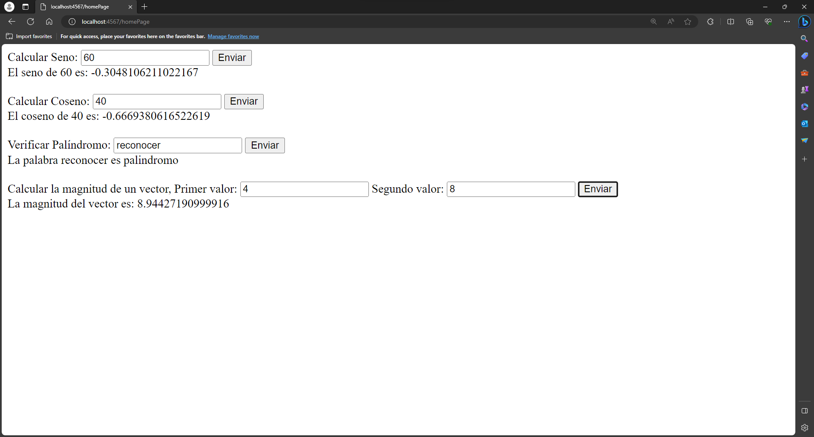

# Taller 6 / Bono Parcial
### Construcción del proyecto
Contrucción de la imagen

Ejecución del contenedor

### Prueba de funcionamiento
Imagen del homepage

Imagen de las respuestas con valores para cada formulario

### Imagen en Docker Hub
La imagen en docker hub se llama miguels007/bono-parcial \
[URL de la imagen](https://hub.docker.com/repository/docker/miguels007/bono-parcial/general)
### Prerequisitos 
Se necesita lo siguiente para correr el proyecto:
- Docker
### Correr el proyecto
Para correr el contenedor tenemos que ejecutar el siguiente comando:
```
docker run -d -p 4567:4567 --name bonoparcial miguels007/bono-parcial
```
Podremos entrar al cliente web entrando en la url [localhost:4567/homePage](localhost:4567/homePage)
